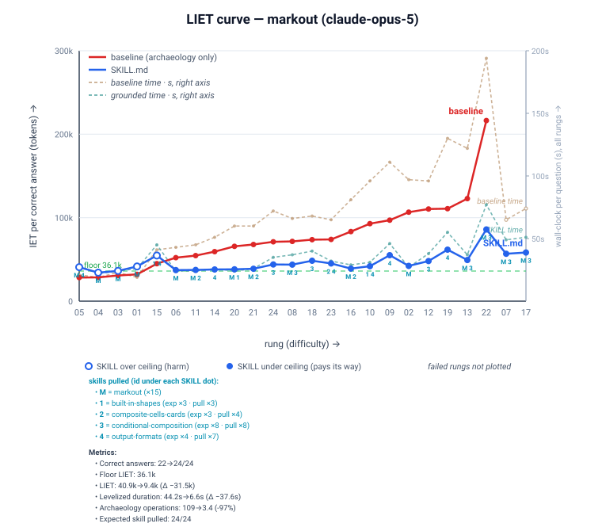
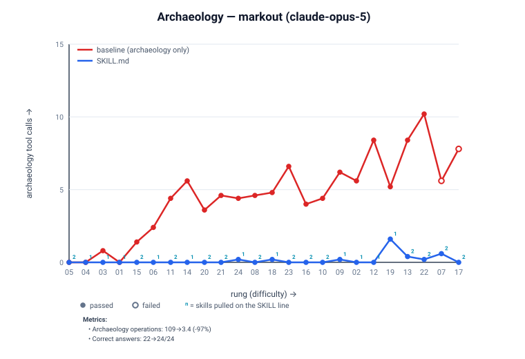

# Markout CT-24 — grounding evidence (graded-yield model)

What the skill shelf buys a consuming agent, measured on the [CT-24 workflow ladder](eval.yaml)
(CT = **Complete Textbook**, the 24-task ladder that ramps from day-1 basics to day-100 niche):
24 bare-fixture scenarios (6 basics + 18 domain, four difficulty rounds) where the agent authors
only the Markout rendering. Prompts describe the library functionally and never name it, so skill
discovery is organic. Each scenario is run **k=5** times per arm; every run is graded independently
on an ascending three-rung ladder, so the unit of evidence is a *yield* (`K/k` delivering runs), not
a single pass/fail. The rungs: **Fails < Satisfies < Delivers** — *Fails* = no working result;
*Satisfies* = works and meets the verifiable requirements (right API, constraints hit), even if
hand-rolled around the taught surface; *Delivers* = *Satisfies* **and** done the idiomatic taught way
(the full-price rung yield counts; Stage 1 proxies `Delivers ≡ Satisfies` — see caveats).

- **Harness:** `richlander/dotnet-package-grounding` + `skill-validator@cb9e32a` (per-run
  capture; graded-yield quality card via `analyze --view ladder` — beta-binomial posterior + nested
  bootstrap bands on both per-dollar IET and per-day duration, plus the ≥20% economic gate). All four
  legs ran on the **same** validator build; all four columns were **re-rendered in a single pass** on
  one harness build, so the bands are mutually comparable.
- **Package:** Markout `0.23.0`; shelf `skills/markout-consumer@f14fec3` (MVV-free). Provenance is
  identical across all four legs — `docContentHash sha256:e35d12a6e562295a`,
  `fixtureHash sha256:83617c5cf63fd96c` — so the only variable is the model.
- **Arms:** `baseline` (no grounding) → `SKILL.md` (the shelf, agent self-selects). **Eval mode:**
  holistic (baseline vs plugin; isolated arm skipped). IET model `anthropic`.
- **Judge:** `claude-haiku-4.5`. **Runs:** n=5 per scenario. **Models:** four, novice → frontier,
  including **two consecutive Opus generations** (4.8 → 5) to read how the effect moves as the
  frontier advances.
- **Methodology:** the ratified two-axis quality card — see
  [`quality-card-model.md`](https://github.com/richlander/dotnet-package-skills/blob/main/docs/quality-card-model.md)
  (the "why") and [`quality-card-spec.md`](https://github.com/richlander/dotnet-package-skills/blob/main/docs/quality-card-spec.md)
  (row-level reference). Only **verifiable requirements** are graded (does it use the taught API /
  approach, hit the technical constraints, and functionally work); subjective quality/idiom is out of
  scope — not gated, not reported.

## The quality card — baseline → `SKILL.md`, four models

Two independent axes — **return** (how often it delivers, over **all k runs of each task** — a
failed run stays in as a scored 0) and **efficiency** (the price *and* speed of a delivery, over
**delivered runs only**) — plus two
gates: do-no-harm and a ≥20% economic-materiality premium. Coverage first splits the tasks three
ways: `S` = *shared success* (both arms deliver), grounded-only unlocks, and baseline-only
regressions. Bands are 95% credible intervals from
one seeded, finite-suite bootstrap (24 tasks held fixed, runs redrawn; beta-binomial posterior on
yield, joint lognormal cost+duration redraw; `S*` recomputed per iteration). Directional goal:
**↑** higher is better · **↓** lower is better.

| quantity (goal) | `claude-haiku-4.5` (mini) | `claude-sonnet-5` (mid) | `claude-opus-4.8` (frontier) | `claude-opus-5` (frontier, next gen) |
| --- | ---: | ---: | ---: | ---: |
| **Coverage** — both-productive `S` (·) | 19 | 23 | 24 | 23 |
| ↳ grounded-only unlocks (↑) | **5** | 1 | 0 | 1 |
| ↳ baseline-only regressions (↓) | 0 | 0 | 0 | 0 |
| **Axis 1 — return (all k runs/task).** mean yield `P` (↑) | 0.533 → 0.942 | 0.775 → 1.000 | 0.883 → 1.000 | 0.925 → 1.000 |
| ↳ ΔP\|both — C2 reliability = *change in* `P` on `S` [95% CrI] (↑) | +0.263 [+0.101, +0.309] | +0.191 [+0.053, +0.220] | +0.117 [−0.006, +0.147] | +0.035 [−0.051, +0.107] |
| ↳ prior robustness (uniform vs Jeffreys) | robust (both exclude 0) | robust (both exclude 0) | ⚠ prior-sensitive | ✗ not established (both include 0) |
| **Axis 2 — efficiency (delivered-only).** per-$ geo-mean IET `Lᵍ/Lᵇ` [95% CrI] (↓, **gate**) | ×0.20 [0.18, 0.33] | ×0.26 [0.23, 0.35] | ×0.40 [0.35, 0.52] | ×0.62 [0.52, 0.76] |
| ↳ pooled `ΣLᵍ/ΣLᵇ` (Simpson guard) (↓) | ×0.11 | ×0.23 | ×0.32 | ×0.52 |
| ↳ per-day geo-mean duration `Lᵍ/Lᵇ` [95% CrI] (↓, co-headline) | ×0.28 [0.26, 0.38] | ×0.21 [0.18, 0.26] | ×0.38 [0.33, 0.44] | ×0.54 [0.51, 0.59] |
| ↳ Total on `S` (aggregate) — IET / duration (↓) | ×0.25 / ×0.23 | ×0.36 / ×0.21 | ×0.44 / ×0.29 | ×0.62 / ×0.50 |
| **Economic gate** — per-$ CrI upper ≤ ×0.80 (certified ≥20% cut) | ×0.33 ✅ | ×0.35 ✅ | ×0.52 ✅ | ×0.76 ✅ |
| **C5** predictability `σ_g/σ_b` (↓) | 0.48 | 0.59 | 0.45 | 0.43 |
| **Do-no-harm gate** — loss mass ≤ null-95 (↓, clean) | 0.000 / 3.200 ✅ | 0.000 / 2.200 ✅ | 0.000 / 1.200 ✅ | 0.000 / 0.800 ✅ |
| **verdict** | both gates · win | both gates · win | both gates · win | both gates · win (cost only) |

(C4 fidelity — the Delivers-vs-Satisfies rate — is **1.00 by construction** in this cut: Stage 1 uses
`Delivers ≡ Satisfies` as a labelled proxy until the delivers-tier assertions land. It is *not yet
independently measured*.)

## Reading the card — grounding buys more as capability falls

The four models trace a clean **monotone** curve: the weaker the model, the more grounding buys.

- **haiku (mini)** — the largest win. Grounding **unlocks 5 tasks the baseline never delivers** (C1
  capability), lifts reliability on the shared work by **+0.26 [robust under both priors]**, and cuts
  the typical delivery to **×0.20 per-dollar** and **×0.28 per-day**. Every axis moves, and the
  reliability gain is real, not a prior artifact.
- **sonnet (mid)** — reliability **and** efficiency both certified: **+0.19 [robust]**, **×0.26
  per-dollar / ×0.21 per-day**, with one capability unlock. The middle of the ladder on every measure.
- **opus 4.8 (frontier)** — the baseline is already near the ceiling, so there is little reliability
  headroom: ΔP\|both is **+0.12 but its band brushes zero** and flips sign-significance between the
  uniform and Jeffreys priors (⚠ prior-sensitive). The win here is unambiguously on **efficiency** — a
  delivery is **×0.40 the price and ×0.38 the time** — not on reliability.
- **opus 5 (next-gen frontier)** — the end state of the trend. The baseline arrives at **0.925 yield
  unaided**, and the reliability gain is now **+0.035 with both priors' bands including zero**: on this
  suite, C2 is **not established**. The efficiency win survives and still clears the gate —
  **×0.62 per-dollar, ×0.54 per-day** — but by the narrowest margin of the four (**CrI upper ×0.76**
  against a ×0.80 bar).

### The generational read — 4.8 → 5

Holding the suite, shelf, harness and fixtures byte-identical, the *only* change is a model generation.
Every quantity moves the same way:

| | opus 4.8 | opus 5 | direction |
| --- | ---: | ---: | --- |
| baseline yield `P` (unaided skill) | 0.883 | 0.925 | model got better |
| ΔP\|both (what grounding adds) | +0.117 | +0.035 | **headroom compressed ~3×** |
| per-$ `Lᵍ/Lᵇ` | ×0.40 | ×0.62 | win shrinking |
| do-no-harm null threshold | 1.200 | 0.800 | gate got **stricter** |
| base skill pulled (of 24 tasks) | 24 | 15 | asks for help less often |

Two honest readings sit side by side. The **reliability** case for grounding is being competed away by
raw model capability — that is the trend, and it is not close. The **efficiency** case is not: a frontier
agent that already knows how to succeed still burns **1.6× the tokens and 1.9× the wall-clock** finding
its way there without the shelf. Grounding's durable value is converging on *cost and speed*, not
*correctness*. Extrapolating one more generation, the per-dollar gate is the one to watch — ×0.76 has
little room left before a future model makes the shelf economically unjustifiable on this suite, which
is exactly the outcome the gate exists to detect.

This is the predicted **frontier-cost / mini-capability asymmetry**, now band-certified across two
frontier generations. All four clear **both gates** — do-no-harm (zero loss mass, well under the
null-calibrated threshold) and the ≥20% economic-materiality premium (per-dollar CrI upper bound ≤ ×0.80
on every model) — and every known bias in the certified path — the `K ≥ 1` winner's curse, the uniform
prior's asymmetric shrinkage — runs *against* grounding. The result survives all of them.

> **On "verdict."** This model has no binary 100%-correct gate. It has **two gates**: **do no harm**
> (no material baseline-only regression) and **economic materiality** (a certified ≥20% per-dollar cut —
> the minimum premium that pays for authoring plus ongoing drift maintenance). Duration co-headlines
> but does not gate. Beyond the gates, the card reports a *graded* two-axis win. A model delivering
> 0.94 yield with five unlocks and both gates clean is a strong win, not a "fail."

---

## Supporting signal — archaeology (the mechanism, not the verdict)

Archaeology is what the agent does when it **lacks** grounding: decompiling the restored package from
the NuGet cache and web-searching the API. It is not a graded axis — it is the **mechanism behind the
cost win** (a decomposition of Work-IET into "digging" vs "producing") and corroboration of the
Delivers *via*-test (heavy digging is the fingerprint of hand-rolling around the taught surface).
Grounding drives it toward zero on every model:

| signal (goal) | `claude-haiku-4.5` | `claude-sonnet-5` | `claude-opus-4.8` | `claude-opus-5` |
| --- | ---: | ---: | ---: | ---: |
| archaeology ops: cache / nuget.org (↓) | 85 / 19 → **0 / 0** | 124 / 1 → **2 / 0** | 104 / 2 → **1 / 0** | 109 / 0 → **3 / 0** |
| tool calls: web / bash / other (·) | 36/486/308 → 0/48/206 | 10/359/212 → 0/55/135 | 6/218/251 → 0/42/184 | 0/214/133 → 0/49/159 |
| session turns (↓) | 30 → 9 | 23 → 8 | 15 → 7 | 12 → 7 |
| wall-clock, raw end-to-end (↓, context) | 158s → 46s (−71%) | 219s → 45s (−79%) | 193s → 56s (−71%) | 72s → 36s (−50%) |
| tasks correct, binary (↑, context) | 13/24 → 23/24 | 20/24 → 24/24 | 20/24 → 24/24 | 22/24 → 24/24 |
| func assertions passed (↑, context) | 110/126 → 125/126 | 122/126 → 126/126 | 122/126 → 126/126 | 124/126 → 126/126 |

The entry fee is the shelf load — ~1.9k tokens of grounding-doc IET per run (a per-trip **toll**, since
the harness runs a fresh session per task); it is already inside every cost number above.

> **On wall-clock, two cuts.** The card's **per-day duration** is the normative speed metric: a
> *delivered-only, paired geo-mean ratio* on one fixed host, so the machine constant cancels and it
> earns a band and a co-headline. The row above is the *raw end-to-end mean* (it includes
> `dotnet build`/restore wait and parallelism), kept as **context** — directionally identical but
> host- and load-dependent, so it is not banded. IET remains the machine-independent price and the
> singular economic gate; all numbers were measured on one host in the same run.

## Supporting signal — cost vs difficulty (the LIET view)

The certified cost number is the geo-mean above; this chart is a **difficulty-resolved view of that
same cost axis** (per-rung levelized IET, baseline curve vs `SKILL.md` curve, difficulty = measured
baseline IET where baseline delivers). The gap between the curves is the grounding lift; it is not a
separate metric.

| `claude-haiku-4.5` | `claude-sonnet-5` | `claude-opus-4.8` | `claude-opus-5` |
| --- | --- | --- | --- |
|  |  |  |  |

The archaeology companion (same x-axis, external-digging on y) makes the mechanism visual:

| `claude-haiku-4.5` | `claude-sonnet-5` | `claude-opus-4.8` | `claude-opus-5` |
| --- | --- | --- | --- |
|  |  |  |  |

## Skills pulled (self-select from shelf, ×scenarios)

- `claude-haiku-4.5` — markout×24 · output-formats×9 · conditional-composition×8 · composite-cells-cards×4 · built-in-shapes×3
- `claude-sonnet-5` — markout×24 · conditional-composition×10 · output-formats×7 · built-in-shapes×4 · composite-cells-cards×4
- `claude-opus-4.8` — markout×24 · conditional-composition×8 · output-formats×7 · composite-cells-cards×4 · built-in-shapes×3
- `claude-opus-5` — markout×15 · conditional-composition×8 · output-formats×7 · composite-cells-cards×4 · built-in-shapes×3

The shelf is a compact base `markout` skill + **four** domain skills. Cross-model, every domain skill
clears the ×0–1 delete threshold on all four models.

Note the one asymmetry: `claude-opus-5` pulls the base `markout` skill on **15 of 24** tasks where every
other model pulls it on all 24, while its *domain*-skill pulls are unchanged. The strongest model
increasingly reaches for grounding only on the specialised work — another face of the same
headroom-compression trend.

## Caveats

- **Stage 1 proxy:** `Delivers ≡ Satisfies` (functional-pass) until the delivers-tier assertions land,
  so C4 fidelity is 1.00 by construction and the *via*-fidelity is corroborated by archaeology→0, not
  yet independently graded.
- **Baseline self-grounds:** even ungrounded, the baseline reads the README/AGENTS packed in the
  restored nupkg and the open web, so its archaeology counts are a **lower bound** — grounding's edge
  is understated. A hermetic (Docker) clean baseline is the follow-up.
- **Bands are finite-suite** (this 24-task suite, tasks held fixed): the verdict generalizes to *this*
  suite's task mix. Bands are seeded and deterministic; a task-population read (outer task redraw) is a
  wider sensitivity bound, not the confirmatory estimand.
- **All four columns were re-rendered together** on one harness build when the `claude-opus-5` leg
  landed. Bands are deterministic per build, so a few haiku/sonnet/opus-4.8 CrI endpoints shift by
  ≤0.004 against the earlier three-model publication (e.g. opus-4.8 ΔP\|both `[−0.007, +0.144]` →
  `[−0.006, +0.147]`). No point estimate, gate or verdict changes; the columns are now mutually
  comparable rather than rendered at different times.
- **`claude-opus-5` C2 is not established** on this suite (both priors' CrI include zero). That is a
  reported null, not a hidden failure: the do-no-harm gate is clean and the economic gate clears on
  cost alone.
