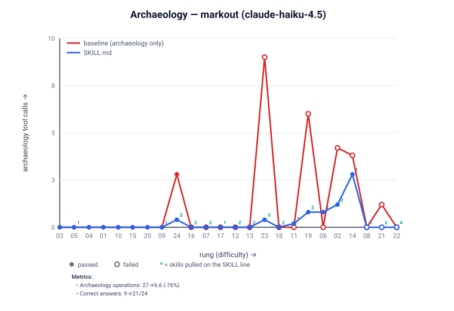
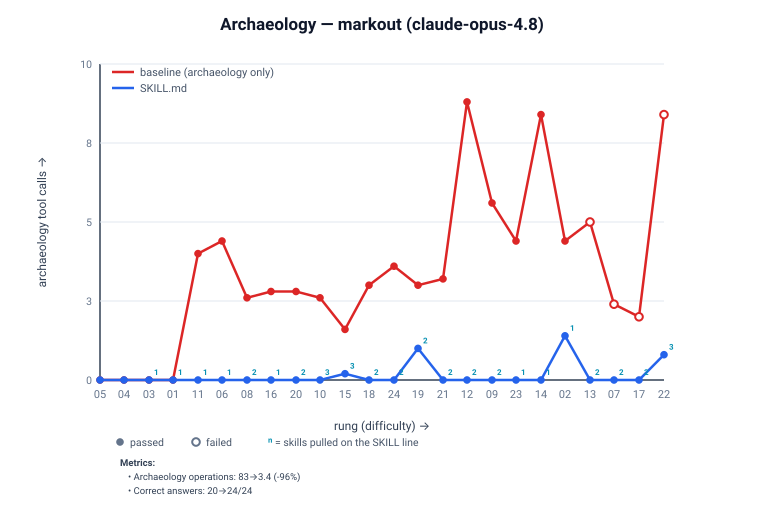

# Markout CT-24 — grounding evidence

What the skill shelf buys a consuming agent, measured on the [CT-24 workflow ladder](eval.yaml):
24 bare-fixture scenarios (6 basics + 18 domain, four difficulty rounds) where the agent authors
only the Markout rendering. Prompts describe the library functionally and never name it, so skill
discovery is organic.

- **Harness:** `richlander/dotnet-package-grounding@7b6e834` + `skill-validator@de363a5` (two-axis verdict + IET decomposition, `analyze --view card`).
- **Package:** Markout `0.23.0`; shelf `skills/markout-consumer@634b53c` (MVV-free).
- **Arms:** `baseline` (no grounding) → `SKILL.md` (the shelf, agent self-selects). **Eval mode:** holistic (baseline vs plugin; isolated arm skipped). IET model `anthropic`.
- **Judge:** `claude-haiku-4.5`. **Runs:** n=5 per scenario (position-swapped).

## Results — baseline → `SKILL.md` (means across 24 scenarios)

| Metric (goal) | `claude-haiku-4.5` | `claude-opus-4.8` |
| --- | ---: | ---: |
| tasks correct (+) | 9/24 → **21/24** | 20/24 → **24/24** |
| relied on grounding: tasks (+) | 0/24 → **13/24** | 0/24 → **18/24** |
| relied on archaeology: cache / nuget.org (−) | 20 / 3 → **6 / 0** | 83 / 0 → **3 / 0** |
| unique skills used (of shelf) (context) | — → 5 | — → 5 |
| func passed (assertions) (+) | 103/126 → **123/126** | 122/126 → **126/126** |
| tool calls: web / bash / other (context) | 4/172/217 → **1**/103/197 | 0/197/192 → **0**/51/181 |
| grounding load (tok) (context) | 0 → 1036 | 0 → 1434 |
| output tok (% of IET) (−) | 5905 (34%) → **4096 (30%)** | 5790 (31%) → **2730 (25%)** |
| tool-call turns (% of total) (−) | 13 (87%) → **9 (86%)** | 12 (90%) → **6 (83%)** |
| Session turns (−) | 14 → **10** | 13 → **7** |
| Session wall-clock, end-to-end (−) | 72 → **51s (−29%)** | 162 → **47s (−71%)** |
| Total IET (−) | 85254 → **66280 (−22%)** | 91164 → **51727 (−43%)** |
| ↳ Grounding IET (doc) | 0 → 2255 | 0 → 2609 |
| ↳ Work IET (agent) (−) | 85254 → **64025 (−25%)** | 91164 → **49118 (−46%)** |
| **verdict** | **FAIL / BETTER** | **PASS / BETTER** |

**Two axes** (independent). **Gate** (correctness): **PASS** = 100% of the tier correct, **FAIL** =
below the gate. **Efficiency**: **BETTER** = more tasks correct / archaeology→0 / work IET cut ≥20%;
a correctness regression forces WORSE (cheaper-but-wrong is never better); a doc can FAIL the gate
yet be BETTER on efficiency.

- **opus `PASS / BETTER`** — clears the 24/24 correctness gate *and* is cheaper: archaeology **83→3** ops (nuget.org web → **0**), Total IET **−43%**.
- **haiku `FAIL / BETTER`** — doesn't clear the gate (21/24), but improves every efficiency axis:
  **+12 correct**, archaeology 23→6 ops, turns 14→10, Total IET **−22%**. The 3 residual misses are
  adherence gates, not broken code (all build + run + emit correct output): CT08/CT22 fail a strict
  source-grep for the prompt-required lever (`IncludeSections` / `ShowWhenProperty`) that haiku
  hand-rolled around, and CT21 emits every correct value but in a plain key-value table instead of the
  required `Metric` shape. opus reaches for the right lever every time (24/24).

> **On wall-clock:** end-to-end wall-clock (72→51s haiku, 162→47s opus) tracks the turn/IET drop but
> is machine- and load-dependent (it includes `dotnet build`/restore wait and parallelism), so it's an
> **informative** signal, not the normative gate — IET is the machine-independent cost metric. The
> numbers above were all measured on one host in the same run.

**Skills pulled** (self-select from shelf, ×scenarios):

- `claude-haiku-4.5` — markout×13 · conditional-composition×8 · composite-cells-cards×6 · output-formats×5 · built-in-shapes×1
- `claude-opus-4.8` — markout×18 · conditional-composition×8 · composite-cells-cards×5 · output-formats×5 · built-in-shapes×3

The shelf is now a compact base `markout` skill + **four** domain skills. Cross-model, every domain skill
clears the ×0–1 delete threshold: `built-in-shapes` is ×1 on haiku but ×3 on opus (opus is the floor that
keeps it on the shelf); the other three pull ≥5 on both. `multi-view-verbosity` self-selected only ×1 on
the 24-scenario ladder and was removed; its collect-less *backpressure* value is held out in
[CT25/CT26](eval.yaml) and it can be restored if the benchmark grows past 24.

> **Caveat:** even ungrounded, the baseline self-grounds from the restored NuGet cache (README/AGENTS
> are packed in the nupkg) and the open web, so its archaeology counts are a **lower bound** —
> grounding's edge is understated. A hermetic (Docker) clean baseline is the follow-up.

## LIET — IET per correct answer vs. difficulty

The baseline (archaeology only) curve is the cost of getting each rung right *without* grounding; the
`SKILL.md` curve is the cost *with* the shelf. The gap between them, levelized across difficulty, is
the grounding lift. `floor` marks the 6 cheapest baseline-correct rungs.

| `claude-haiku-4.5` | `claude-opus-4.8` |
| --- | --- |
|  |  |

## Archaeology — fallback digging (cache + web) the agent resorts to

Archaeology is what the agent does when it *lacks* grounding: decompiling the restored package from
the NuGet cache and web-searching the API. Grounding drives it toward zero.

| `claude-haiku-4.5` | `claude-opus-4.8` |
| --- | --- |
|  |  |
